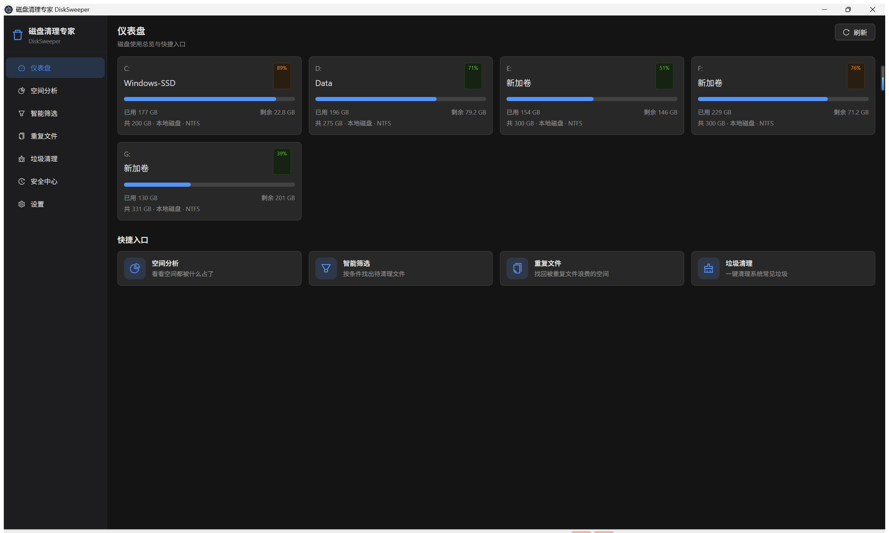
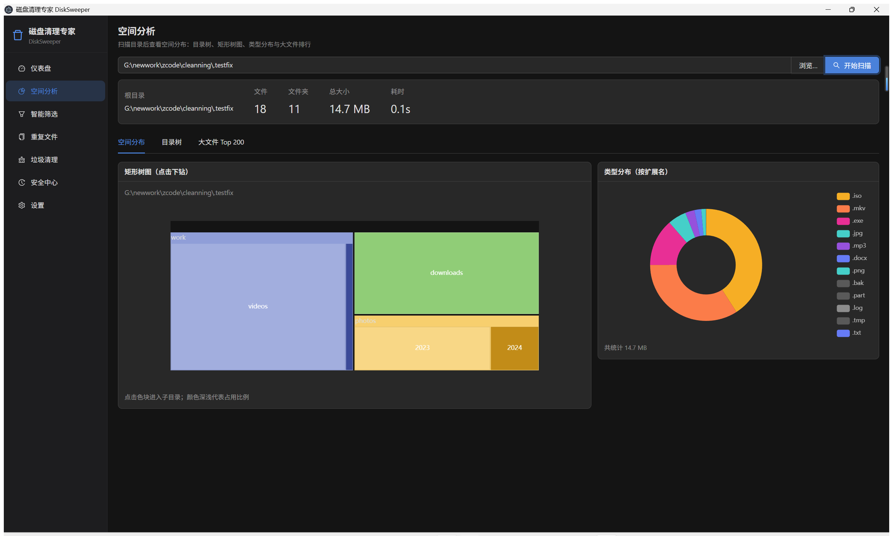
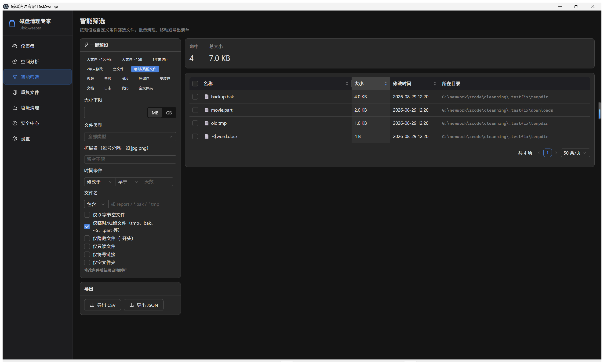
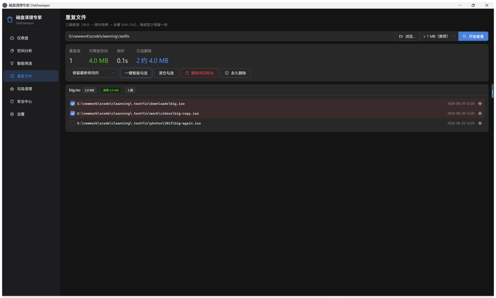
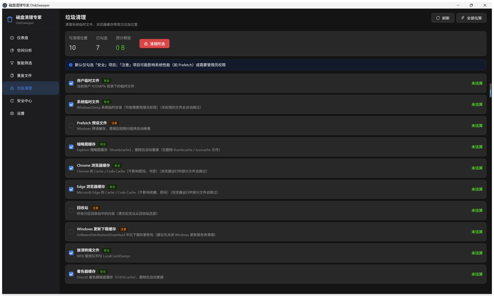
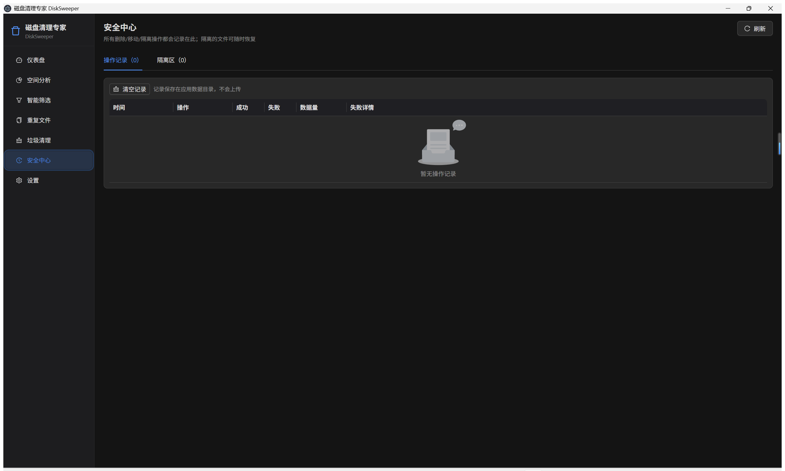
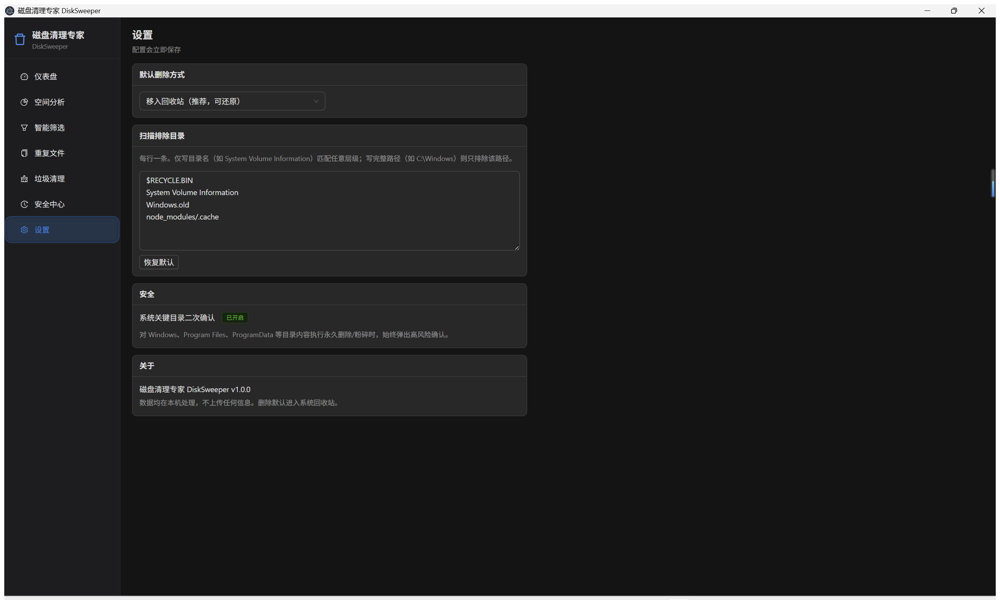

# 磁盘清理专家 DiskSweeper

<p align="center">
  <b>一款现代化的 Windows 文件筛选与磁盘清理桌面工具</b><br/>
  Electron · React 18 · TypeScript · Ant Design 5 · ECharts
</p>

---

## ✨ 项目简介

DiskSweeper（磁盘清理专家）是一款运行在 Windows 上的开源桌面应用，帮助你**看清磁盘空间去向、精准筛选目标文件、安全批量清理**。它整合了多款经典开源工具的核心能力：

| 借鉴对象 | 吸收的能力 |
|---|---|
| [WinDirStat](https://windirstat.net/) | 目录树 + 矩形树图的空间可视化 |
| [BleachBit](https://www.bleachbit.org/) | 系统垃圾位置清单与安全清理 |
| [dupeGuru](https://dupeguru.voltaicideas.net/) | 重复文件智能保留策略 |
| [Czkawka](https://github.com/qarmin/czkawka) | 三级哈希查重、多线程扫描、缓存思路 |

所有数据均在本机处理，**不上传任何信息**。

## 🖼️ 界面预览

<table>
  <tr>
    <td width="50%" align="center"><b>仪表盘</b><br/><sub>磁盘分区总览 · 快捷入口</sub><br/></td>
    <td width="50%" align="center"><b>空间分析</b><br/><sub>矩形树图下钻 · 类型分布 · 大文件榜 · 属性面板</sub><br/></td>
  </tr>
  <tr>
    <td width="50%" align="center"><b>智能筛选</b><br/><sub>一键预设 + 自定义条件 · 批量清理 · 导出清单</sub><br/></td>
    <td width="50%" align="center"><b>重复文件查找</b><br/><sub>三级哈希检测 · 智能保留策略 · 每组至少留一份</sub><br/></td>
  </tr>
  <tr>
    <td width="50%" align="center"><b>垃圾清理</b><br/><sub>10 类常见垃圾位置 · 安全等级 · 清理日志</sub><br/></td>
    <td width="50%" align="center"><b>安全中心</b><br/><sub>操作记录 · 隔离区可恢复</sub><br/></td>
  </tr>
  <tr>
    <td width="50%" align="center"><b>设置</b><br/><sub>默认删除方式 · 排除目录</sub><br/></td>
    <td width="50%" align="center"></td>
  </tr>
</table>

> 更多细节：空间分析中点击任意文件可查看完整属性（实际大小/磁盘占用、创建/修改/访问时间、只读/隐藏/系统属性等）；筛选结果可一键定位到资源管理器所在位置。

## 🚀 快速开始

### 环境要求

- **Node.js ≥ 18**（推荐 20+，本项目在 Node 24 上开发验证）
- **npm ≥ 9**
- Windows 10 / 11（垃圾清理、回收站、盘符检测等能力依赖 Windows）

### 方式一：下载安装包（推荐普通用户）

从 [Releases](https://github.com/zhSlamer/DiskSweeper/releases) 页面下载：

- `DiskSweeper-x.x.x-setup.exe` —— 安装版，双击安装
- `DiskSweeper-x.x.x-portable.exe` —— 便携版，免安装直接运行

### 方式二：从源码运行（开发者）

```bash
# 1. 克隆仓库
git clone https://github.com/zhSlamer/DiskSweeper.git
cd DiskSweeper

# 2. 安装依赖（首次会自动下载 Electron 二进制，约 1-2 分钟）
npm install

# 3. 启动开发模式（支持热更新）
npm run dev
```

### 方式三：本地打包

```bash
# 类型检查 + 构建 + 打包（产物在 dist/ 目录）
npm run dist
# 生成：dist/DiskSweeper-1.0.0-setup.exe 与 dist/DiskSweeper-1.0.0-portable.exe
```

## 📜 可用脚本

| 命令 | 说明 |
|---|---|
| `npm run dev` | 开发模式运行（electron-vite dev，热更新） |
| `npm run typecheck` | 主进程 + 渲染进程 TypeScript 类型检查 |
| `npm run build` | 类型检查并构建产物到 `out/` |
| `npm run dist` | 构建并打包为 Windows 安装包 + 便携版 |
| `npm run fixtures` | 在 `.testfix/` 生成测试目录（大文件/重复文件/空文件/临时文件等，用于自测） |

## 🏗️ 项目结构

```
DiskSweeper/
├─ electron/                  # 主进程
│  ├─ main.ts                 # 应用入口、窗口创建
│  ├─ ipc.ts                  # IPC 通道注册（前后端唯一桥梁）
│  ├─ preload/
│  │  └─ index.ts             # contextBridge 暴露安全 API
│  ├─ workers/
│  │  ├─ scanWorker.ts        # 扫描 worker：目录展开、文件属性收集
│  │  └─ hashWorker.ts        # 哈希 worker：部分/全量 SHA-256
│  └─ services/
│     ├─ scanner.ts           # 扫描引擎（线程池、目录聚合、树图数据）
│     ├─ filterEngine.ts      # 筛选引擎（预设/自定义条件、导出）
│     ├─ duplicates.ts        # 重复文件三级检测流水线
│     ├─ junk.ts              # Windows 垃圾位置清单、估算与清理
│     ├─ fileOps.ts           # 删除/移动/隔离/粉碎（回收站走 Shell COM）
│     ├─ drives.ts            # 磁盘分区列表（PowerShell + statfs 双通道）
│     ├─ history.ts           # 操作历史（JSONL 追加存储）
│     └─ settings.ts          # 用户设置持久化
├─ src/                       # 渲染进程（React）
│  ├─ App.tsx                 # 侧边栏导航外壳
│  ├─ pages/                  # 7 个页面
│  │  ├─ Dashboard.tsx        # 仪表盘
│  │  ├─ Analyzer.tsx         # 空间分析
│  │  ├─ SmartFilter.tsx      # 智能筛选
│  │  ├─ Duplicates.tsx       # 重复文件
│  │  ├─ JunkCleaner.tsx      # 垃圾清理
│  │  ├─ History.tsx          # 安全中心
│  │  └─ Settings.tsx         # 设置
│  ├─ components/             # 树图/饼图/文件属性抽屉等
│  └─ stores/                 # Zustand 全局状态
├─ shared/                    # 主/渲染进程共享：类型定义、IPC 通道名、常量与工具
├─ scripts/                   # 测试数据生成、截图脚本
├─ docs/screenshots/          # 界面截图
└─ electron.vite.config.ts    # 构建配置
```

## 🔧 技术要点

- **扫描性能**：主进程维护 worker 线程池（默认 `min(CPU核数, 8)` 个），目录展开并行执行；worker 意外退出时自动重新排队在途目录并补充线程，扫描不中断、进度不卡死
- **大目录友好**：树图按字节预算裁剪节点、文件表格分页 + 排序下推到主进程、Top 榜排序结果缓存
- **删除安全**：
  - 默认删除到**系统回收站**（通过 Windows Shell COM `InvokeVerb('delete')`，可随时还原）
  - "隔离"模式把文件移入应用数据目录并记录原路径，支持一键恢复
  - "永久删除 / 粉碎"对 `Windows`、`Program Files` 等系统关键路径强制高风险二次确认
  - 粉碎 = 先以 0x00 / 0xFF 覆写两遍再删除
- **进程隔离**：`contextIsolation` 开启、`nodeIntegration` 关闭，渲染进程仅能调用 preload 白名单 IPC；未捕获错误经 `console-message` 转发到终端便于诊断
- **垃圾清理**：只按白名单位置与文件名模式（如 `thumbcache_*`）删除，浏览器缓存不动密码与书签；被占用/无权限文件自动跳过并计数

## ❓ 常见问题

**Q：扫描整个 C 盘很慢 / 大量"无法访问"？**
系统目录与其它用户的文件没有读取权限，应用会自动跳过并计入"无法访问"数量，不影响其余部分。建议优先扫描具体目录。

**Q：删除的文件去哪了？**
默认进入系统回收站；可在设置中修改默认行为，或在操作时选择隔离 / 永久删除 / 粉碎。

**Q：垃圾清理需要管理员权限吗？**
用户级垃圾（%TEMP%、浏览器缓存、缩略图等）不需要；`Windows\Temp`、更新缓存等系统位置无权限的文件会被自动跳过。

**Q：会收集我的数据吗？**
不会。所有扫描、哈希、清理均在本地完成；操作历史仅保存在本机应用数据目录。

## 🛣️ Roadmap

- [ ] 文件名/内容全文搜索
- [ ] 空间快照对比（两次扫描 diff，找出新增大文件）
- [ ] 相似图片检测（感知哈希）
- [ ] 多语言（英文界面）
- [ ] 自动更新（electron-updater）

## 📝 更新日志

### v1.0.3（2026-08-29）

**修复**

- **修复扫描盘根（如 `C:\`）后"打开所在位置"无效的问题**：根目录带尾分隔符时路径被拼成 `C:\\...` 双反斜杠，导致资源管理器定位/打开文件静默失败。所有路径拼接改用 `path.join`，扫描任意目录（含盘根）均生成标准路径
- "打开所在位置"现在会校验文件是否存在，文件已被删除/移动时给出明确提示，不再静默无反应

### v1.0.2（2026-08-29）

**修复**

- 仪表盘磁盘卡片点击后不自动扫描（跨页事件在页面挂载前派发丢失）
- 回收站批量删除逐文件启动 PowerShell 进程导致大批量极慢，改为单会话批量执行；不存在的路径误计为成功
- 导出筛选结果丢失表格排序、超 5 万行静默截断（现按当前排序导出，上限 10 万行且截断有提示）
- 智能筛选翻页丢失已勾选项，改为跨页保留
- 粉碎删除多写一次无意义的 1MB 首块
- 操作记录 rowKey 可能重复；设置页"系统关键目录额外警告"补充可用开关
- 新增单实例锁防止双开

**优化**

- 筛选结果缓存：翻页/重查命中缓存时不再全量重新过滤排序

### v1.0.1（2026-08-29）

**修复**

- 打开文件行为修正：文件属性抽屉的主按钮改为「打开所在位置」，点击后直接在资源管理器中定位该文件，不再用默认程序打开文件（此前筛选到 exe 等文件时会被直接运行）
- 可执行文件运行确认：「打开文件」对 exe / msi / bat 等可执行文件增加二次确认，避免误运行
- 智能筛选结果表与空间分析大文件榜新增定位操作列，一键打开文件所在文件夹

### v1.0.0（2026-08-29）

首个版本。

**功能**

- **仪表盘**：全部磁盘分区使用总览（总量/已用/剩余/进度条）、快捷入口、上次扫描摘要
- **空间分析**：多线程扫描（实时进度、可取消、自动跳过无权限目录）、矩形树图下钻、目录树、按扩展名类型分布饼图、大文件 Top 200、文件属性面板（实际大小/磁盘占用、三种时间、只读/隐藏/系统/符号链接属性、资源管理器定位）
- **智能筛选**：15 种一键预设（大文件 / 1 年未访问 / 空文件 / 空文件夹 / 临时残留 / 视频 / 音频 / 图片 / 压缩包 / 安装包 / 文档 / 日志 / 代码等）+ 自定义组合条件（大小、扩展名、时间、文件名包含/通配符/正则、文件属性），批量删除到回收站 / 隔离 / 移动 / 永久删除 / 粉碎，CSV / JSON 导出
- **重复文件查找**：大小 → 头 64KB 部分哈希 → 全量 SHA-256 三级检测，智能保留策略（最新/最旧/第一个），每组硬性至少保留一份
- **垃圾清理**：10 类 Windows 垃圾位置（用户/系统 Temp、Prefetch、缩略图缓存、Chrome/Edge 缓存、回收站、Windows 更新缓存、崩溃转储、着色器缓存），逐项估算、安全等级标注、清理日志
- **安全中心**：完整操作历史、隔离区（可一键恢复）、系统关键目录强制二次确认
- **设置**：默认删除方式、扫描排除目录（目录名/完整路径）

下载：[v1.0.0 Release](https://github.com/zhSlamer/DiskSweeper/releases/tag/v1.0.0)

## 📄 许可证

[MIT](LICENSE) © zhSlamer
